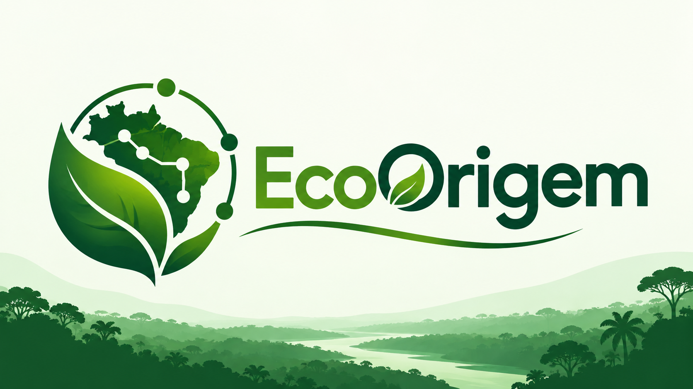
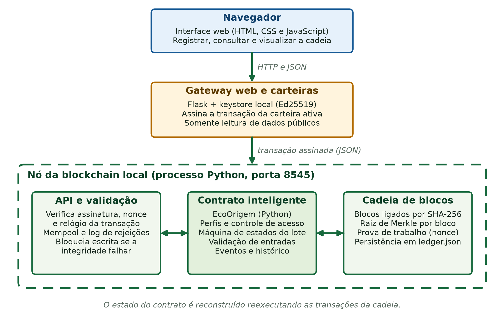
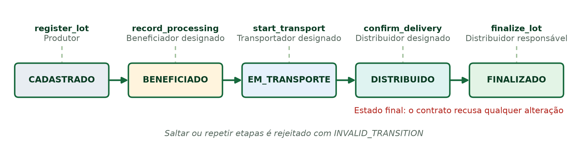
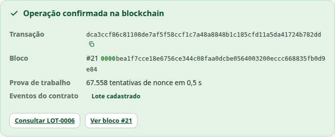
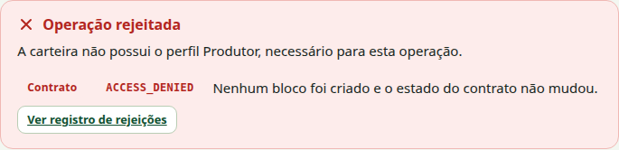
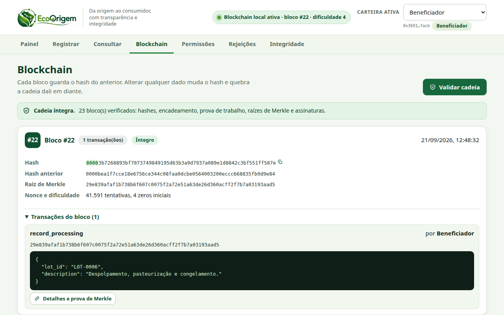
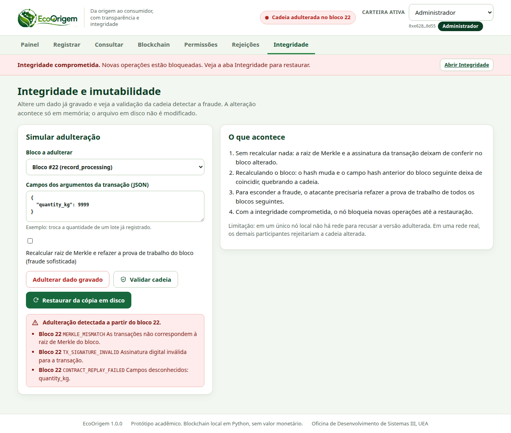

<p align="center">
  
</p>

<p align="center">
  Rastreabilidade de produtos da bioeconomia amazônica em uma blockchain local
  escrita em Python, com contrato inteligente e interface web.
  <br />
  <em>Trabalho do 1º bimestre | Oficina de Desenvolvimento de Sistemas III | UEA</em>
</p>

---

<h2 align="center">Tecnologias</h2>

<div align="center">
  
  
  
  
  
  
</div>

---

<h2 align="center">Sobre o projeto</h2>

O **EcoOrigem** registra o ciclo de vida de lotes de açaí, castanha, murumuru,
cupuaçu e óleos vegetais, da coleta ao consumidor. Cada etapa
(cadastro, beneficiamento, transporte, recebimento e finalização) vira uma
transação assinada, validada por um contrato inteligente e gravada em um bloco
minerado com prova de trabalho.

Público: cooperativas, beneficiadores, transportadores, distribuidores,
auditores e consumidores que precisam conferir a origem de um produto.

Produtor &rarr; Beneficiador &rarr; Transportador &rarr; Distribuidor &rarr; Consumidor

A lógica segue as aulas do professor Fábio Santos: bloco com hash SHA-256,
encadeamento por hash anterior, nonce e prova de trabalho, validação da cadeia e
aplicação descentralizada com interface, contrato e blockchain. Sobre esse
modelo foram acrescentados árvore de Merkle, transações com assinatura digital
Ed25519 e um nó com contrato inteligente.

---

<h2 align="center">Problema e justificativa</h2>

| Item | Descrição |
| --- | --- |
| Problema | Cada participante da cadeia guarda o próprio registro. O consumidor não sabe qual versão é a verdadeira e quem administra o sistema pode reescrever o histórico |
| Objetivo | Registrar cada etapa do lote de forma verificável, com regras que impedem atalhos e alterações |
| Por que blockchain | Vários participantes precisam confiar no mesmo histórico e nenhum deles deve poder alterá-lo sozinho. Alterar um bloco quebra o encadeamento dali em diante |
| O que a blockchain não garante | Que a informação esteja correta na origem. Ela garante que o registro não muda depois de gravado |

---

<h2 align="center">Arquitetura</h2>

<p align="center">
  
</p>

| Componente | Tecnologia | Responsabilidade |
| --- | --- | --- |
| Interface web | HTML, CSS e JavaScript em [assets/](assets/) | Registrar, consultar, explorar blocos e simular adulteração |
| Gateway e carteiras | [ecoorigem/web/](ecoorigem/web/) | Guarda as chaves de demonstração e assina a transação da carteira ativa |
| Nó da blockchain | [ecoorigem/node/](ecoorigem/node/) | Valida, executa o contrato, minera, persiste e registra rejeições |
| Contrato inteligente | [ecoorigem/contract/](ecoorigem/contract/) | Perfis, máquina de estados, validações e eventos |
| Blockchain | [ecoorigem/blockchain/](ecoorigem/blockchain/) | Blocos, prova de trabalho, árvore de Merkle, assinaturas e validação |

O detalhamento das decisões está no [relatório técnico](docs/relatorio/relatorio-tecnico-ecoorigem.pdf).

---

<h2 align="center">Contrato inteligente</h2>

<p align="center">
  
</p>

| Perfil | Operação | Regra |
| --- | --- | --- |
| Administrador | Conceder e revogar perfis | É a conta que implantou o contrato |
| Produtor | `register_lot` | Produto da lista aceita, quantidade positiva, data não futura. Designa o beneficiador do lote |
| Beneficiador | `record_processing` | Somente lote CADASTRADO e somente o beneficiador designado. Designa o transportador do lote |
| Transportador | `start_transport` | Somente lote BENEFICIADO e somente o transportador designado, com distribuidor válido designado |
| Distribuidor | `confirm_delivery` e `finalize_lot` | Só o distribuidor designado confirma e só o responsável atual finaliza |
| Responsável atual | `attach_document` | Registra o hash de um documento, nunca o arquivo |
| Qualquer pessoa | Consultas | Leitura pública, sem carteira |

Cada etapa designa quem executa a próxima: o produtor escolhe o beneficiador, o
beneficiador escolhe o transportador e o transportador escolhe o distribuidor.
Outra carteira com o mesmo perfil recebe `ACCESS_DENIED`.

Saltar ou repetir etapas retorna `INVALID_TRANSITION`, e qualquer operação sobre
um lote FINALIZADO retorna `LOT_FINALIZED`. A referência completa está em
[docs/relatorio/contrato-inteligente.md](docs/relatorio/contrato-inteligente.md).

---

<h2 align="center">Dados na blockchain</h2>

| Na blockchain | Fora da blockchain |
| --- | --- |
| Identificador, produto, origem, quantidade e data de coleta | Arquivos de certificados, laudos e fotos |
| Status atual e cada mudança de etapa, com data e bloco | Dados pessoais de produtores e trabalhadores |
| Endereço da carteira responsável por cada operação | Chaves privadas (ficam no keystore local) |
| Perfis concedidos e revogados | Log das operações rejeitadas (mantido pelo nó) |
| Hash SHA-256 dos documentos anexados | Conteúdo dos documentos |
| Assinatura digital de cada transação | Senhas ou credenciais |

---

<h2 align="center">Estrutura do projeto</h2>

```text
EcoOrigem/
├── assets/                 # assets do sistema: css, js e imagens da interface
├── docs/
│   ├── relatorio/          # relatório técnico (docx e pdf) e referência do contrato
│   ├── slides/             # apresentação (pptx e pdf), roteiro e vídeo de apoio
│   ├── evidencias/         # cenários de teste e métricas medidas
│   └── assets/             # diagramas, evidências, produtos, logos e recortes dos slides
├── ecoorigem/
│   ├── blockchain/         # bloco, cadeia, Merkle, carteira, transação
│   ├── contract/           # contrato inteligente EcoOrigem
│   ├── node/               # nó: mempool, mineração, persistência, API HTTP
│   ├── web/                # gateway com carteiras e template da interface
│   ├── client.py  bootstrap.py  keystore.py  config.py  __main__.py
├── scripts/                # cenários, gravação da demo, diagramas, relatório, slides, menu
├── tests/                  # 251 testes com pytest
├── Dockerfile  docker-compose.yml  Makefile
└── requirements*.txt  pyproject.toml
```

---

<h2 align="center">Como executar</h2>

### Requisitos

- Docker Engine 24+ com Docker Compose, ou Python 3.10+ com `make`
- Nenhuma credencial é necessária. As carteiras de demonstração são geradas localmente

### Com Docker

```bash
git clone https://github.com/JulianaBallin/EcoOrigem.git
cd EcoOrigem
make docker-up      # nó, implantação do contrato e interface
make docker-seed    # opcional: lotes de demonstração
```

Interface em <http://127.0.0.1:5000> e nó em <http://127.0.0.1:8545>.
O serviço `deploy` implanta o contrato e concede os perfis antes de a interface subir.

### Sem Docker

```bash
make venv           # cria .venv-ecoorigem e instala as dependências
make node           # terminal 1: inicia a blockchain local
make deploy         # terminal 2: implanta o contrato e concede os perfis
make app            # terminal 3: inicia a interface
```

`make start` faz os três passos em segundo plano e `make stop` os encerra.

### Menu interativo

```bash
make menu
```

| Comando | Função |
| --- | --- |
| `make menu` | Menu interativo com todas as opções explicadas |
| `make venv` | Cria o ambiente virtual e instala as dependências |
| `make test`, `make coverage` | Testes, com ou sem cobertura |
| `make lint`, `make format`, `make security` | Pylint, Black, Bandit e pip-audit |
| `make scenarios` | Executa os cenários e gera a tabela de resultados |
| `make docker-test` | Executa os testes dentro de um contêiner |
| `make report`, `make slides` | Gera o relatório e a apresentação |
| `make docker-reset`, `make reset` | Apagam a blockchain e as carteiras |

Variáveis úteis estão em [.env.example](.env.example), como a dificuldade da prova de trabalho.

---

<h2 align="center">Testes e qualidade</h2>

| Verificação | Ferramenta | Resultado |
| --- | --- | --- |
| Testes automatizados | pytest | 251 aprovados |
| Cobertura | pytest-cov | 97% |
| Análise estática | Pylint | 10 de 10 |
| Formatação | Black | sem pendências |
| Segurança do código | Bandit | sem achados no pacote |
| Dependências | pip-audit | sem vulnerabilidades conhecidas |
| Composição de software | Black Duck | não executado: ferramenta indisponível neste ambiente |

Os **48 cenários** de [docs/evidencias/cenarios-de-teste.md](docs/evidencias/cenarios-de-teste.md)
comparam resultado esperado e obtido para operações válidas, entradas inválidas,
falta de permissão e adulteração de blocos. Reproduza com `make scenarios`.

---

<h2 align="center">Evidências</h2>

| Registro confirmado | Rejeição sem permissão |
| --- | --- |
|  |  |

| Explorador de blocos | Adulteração detectada |
| --- | --- |
|  |  |

O [vídeo de apoio](docs/slides/video/demonstracao.webm) mostra a demonstração completa
e serve de plano B em caso de falha técnica.

---

<h2 align="center">Documentação</h2>

| Documento | Conteúdo |
| --- | --- |
| [Relatório técnico](docs/relatorio/relatorio-tecnico-ecoorigem.pdf) ([docx](docs/relatorio/relatorio-tecnico-ecoorigem.docx)) | Problema, objetivos, justificativa, arquitetura, implementação, testes, limitações e conclusão |
| [Apresentação](docs/slides/apresentacao-ecoorigem.pdf) ([pptx](docs/slides/apresentacao-ecoorigem.pptx)) | 11 slides da apresentação de 10 minutos |
| [Créditos das fotos](docs/assets/produtos/CREDITOS.md) | Autoria e licença das fotos de produtos usadas nos slides |
| [Cenários de teste](docs/evidencias/cenarios-de-teste.md) | Operações realizadas, resultados esperados e obtidos |
| [Contrato inteligente](docs/relatorio/contrato-inteligente.md) | Métodos, argumentos, perfis e códigos de erro |
| [Roteiro](docs/slides/roteiro-apresentacao.md) | Divisão do tempo, checklist da demonstração e plano de contingência |

---

<h2 align="center">Limitações</h2>

- A blockchain roda em um único nó local. A validação detecta a adulteração, mas
  não há rede de nós para recusar a versão alterada.
- A prova de trabalho é didática, com dificuldade baixa.
- As carteiras de demonstração ficam em um keystore no gateway, e não em uma
  extensão como o MetaMask. Não use essas chaves fora de demonstrações.
- A blockchain garante que o registro não muda, não que a informação seja
  verdadeira na origem.
- O estado é reconstruído reexecutando a cadeia e o armazenamento é um arquivo
  JSON, adequados a um protótipo.

---

<h2 align="center">Equipe</h2>

<div align="center">

| Integrante |
| :-- |
| **Ana Beatriz Maciel Nunes** |
| **Fernando Luiz da Silva Freire** |
| **Juliana Ballin Lima** |

</div>

Professor: Prof. Dr. Fábio Santos. Licença [MIT](LICENSE).

<p align="center">
  <a href="https://github.com/JulianaBallin/EcoOrigem">github.com/JulianaBallin/EcoOrigem</a>
</p>
